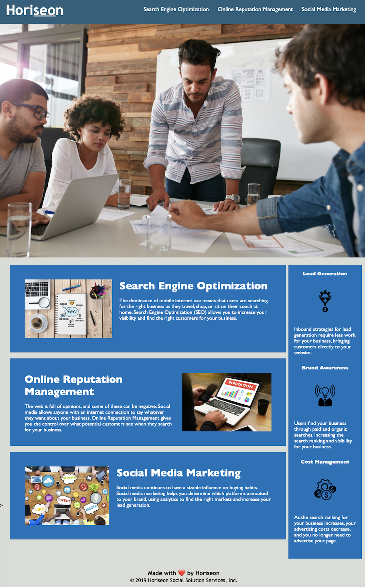

# Code-Refactor-Horiseon
Horiseon - A Search Engine Optimization & Marketing company.

https://ila0406.github.io/Code-Refactor-Horiseon/

# Description
Univerisiry of Denver - Full Stack Web Developer Boot camp. For week one of bootcamp, a marketing agency has "hired" me to refactor their existing site to make it more accessible. I have updated the website to be more accessible by organizing the HTML elements, added alt attributes, and updated the HTML elements to semantic ones. 

This was an "on-the-job-ticket" to refactor the existing code 

# Credits
Made with ❤️️ by Horiseon</h2>
&copy; 2019 Horiseon Social Solution Services, Inc.

# Accessibility

# Mock-Ups

### The following image shows the web application's appearance and functionality before refactoring:

### The following image shows the web application's appearance and functionality after refactoring:

